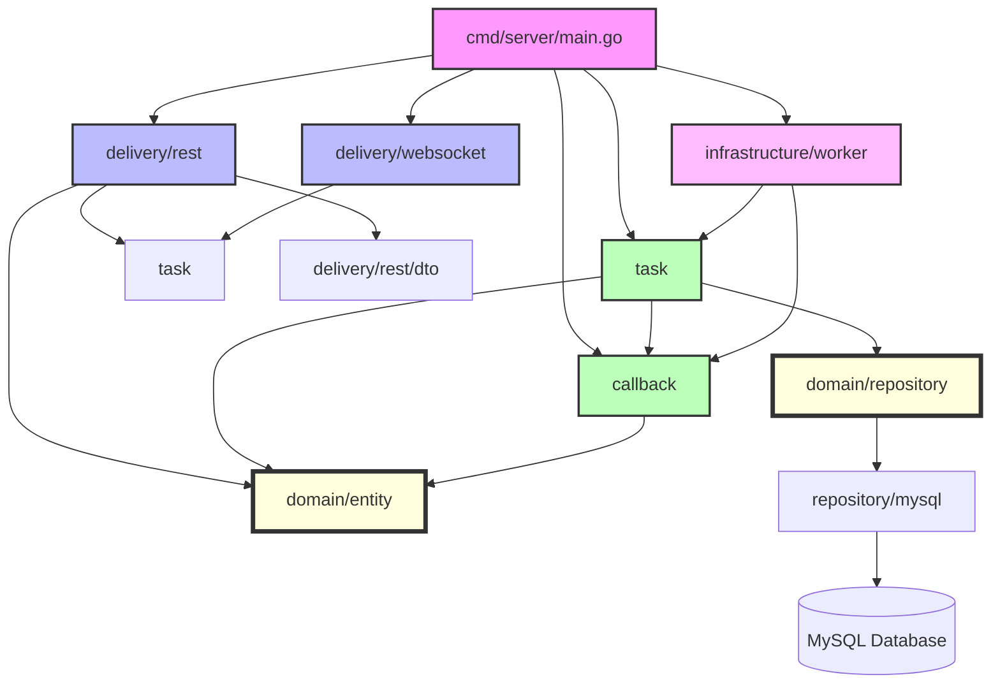

# Refactor Backend to Follow go-clean-arch Structure

## Overview

Restructure the **Later** backend codebase to follow the standard go-clean-arch pattern as demonstrated in [bxcodec/go-clean-arch](https://github.com/bxcodec/go-clean-arch). This refactoring will improve code organization, maintainability, and testability while preserving all existing functionality and API contracts.

## Current State Analysis

### Current Structure

```
internal/
├── domain/
│   ├── models/
│   │   └── task.go
│   └── repositories/
│       └── task_repository.go
├── dto/
│   ├── task.go
│   ├── custom_time.go
│   └── json_bytes.go
├── handler/
│   └── handler.go
├── middleware/
│   ├── cors.go
│   ├── recovery.go
│   └── logger.go
├── repository/
│   └── mysql/
│       ├── connection.go
│       └── task_repository.go
├── usecase/
│   ├── task_service.go
│   ├── scheduler.go
│   ├── worker.go
│   └── callback_service.go
├── infrastructure/
│   ├── circuitbreaker/
│   │   └── circuit_breaker.go
│   └── logger/
│       └── logger.go
├── server/
│   └── server.go
└── websocket/
    └── hub.go
```

### Issues with Current Structure

1. **Mixed concerns**: `dto/` sits alongside `domain/`, blurring the domain boundary
2. **Handler naming**: `handler/` instead of `rest/` or `delivery/` makes it unclear this is the delivery layer
3. **Infrastructure in internal**: Circuit breaker and logger are in `internal/infrastructure/` when they should be separate
4. **Domain logic spread**: Business rules are split between `domain/models/` and `usecase/`
5. **Missing clear boundaries**: It's unclear which layer owns what (e.g., `websocket/` should be infrastructure/delivery)

### Target Structure (Reference: bxcodec/go-clean-arch)

```
.
├── domain/
│   ├── entity/          # Core business entities (was models/)
│   │   └── task.go
│   ├── repository/      # Repository interfaces (was domain/repositories/)
│   │   └── task_repository.go
│   └── errors.go        # Domain-specific errors
├── task/                # Use case layer (named after aggregate root)
│   ├── service.go       # Business logic interfaces + implementation
│   ├── scheduler.go
│   ├── worker.go
│   └── mocks/           # Generated mocks for testing
├── delivery/rest/       # HTTP delivery layer (was handler/)
│   ├── handler.go
│   ├── middleware/
│   └── routes.go
├── delivery/websocket/  # WebSocket delivery layer (was websocket/)
│   └── hub.go
├── repository/
│   └── mysql/
│       ├── connection.go
│       └── task_repository.go
└── infrastructure/
    ├── logger/
    │   └── logger.go
    └── circuitbreaker/
        └── circuit_breaker.go
```

**Key Differences from Reference:**

- **Named usecase layers**: Instead of `article/`, we'll use `task/` since that's our aggregate root
- **Delivery layer naming**: Using `delivery/` instead of `rest/` to accommodate both REST and WebSocket
- **Infrastructure location**: Moving `infrastructure/` out of `internal/` to follow dependency rule

## Clean Architecture Principles

### Dependency Rule

```
Source code dependencies must point only inward, toward high-level policies.
```

**Layers (outer → inner):**
1. **Delivery Layer** (`delivery/`, `delivery/rest/`, `delivery/websocket/`) - HTTP/WebSocket handlers
2. **Use Case Layer** (`task/`, `callback/`) - Business logic orchestration
3. **Domain Layer** (`domain/`) - Entities and repository interfaces
4. **Infrastructure** (outside `internal/`) - External concerns

**No dependencies allowed:**
- ❌ Domain → Use Case
- ❌ Domain → Delivery
- ❌ Use Case → Delivery

### Key Changes

1. **DTOs move to delivery layer**: Request/response structs belong in `delivery/rest/` not at root
2. **Domain errors**: Add `domain/errors.go` with standard error types
3. **Repository interfaces**: Stay in `domain/repository/` (already correct)
4. **Entities**: Rename `models/` to `entity/` for clarity
5. **Service naming**: UseCase layer services define their own repository interfaces (like reference)

## Migration Strategy

### Phase 1: Prepare Structure (Non-Breaking)

Create new directories and copy files without modifying existing code:

```bash
# Create new structure
mkdir -p internal/domain/entity
mkdir -p internal/domain/errors
mkdir -p internal/task
mkdir -p internal/delivery/rest
mkdir -p internal/delivery/rest/middleware
mkdir -p internal/delivery/websocket

# Move domain files
mv internal/domain/models/* internal/domain/entity/
mv internal/domain/repositories/* internal/domain/repository/
rmdir internal/domain/models internal/domain/repositories

# Move delivery files
mv internal/handler/* internal/delivery/rest/
mv internal/middleware/* internal/delivery/rest/middleware/
mv internal/websocket/* internal/delivery/websocket/
rmdir internal/handler internal/middleware internal/websocket

# Move usecase files
mv internal/usecase/task_service.go internal/task/
mv internal/usecase/scheduler.go internal/task/
mv internal/usecase/worker.go internal/task/
rmdir internal/usecase
```

**Acceptance Criteria:**
- [ ] New directory structure created
- [ ] Files moved to new locations
- [ ] Old `internal/{handler,middleware,websocket,usecase}` directories removed
- [ ] No functional changes to code
- [ ] All imports updated to reflect new paths

### Phase 2: Update Imports (Non-Breaking)

Update all import paths throughout the codebase:

**Files requiring import updates:**

1. `cmd/server/main.go` - Update handler, usecase, websocket imports
2. `internal/delivery/rest/handler.go` - Update usecase imports
3. `internal/task/task_service.go` - Update domain imports
4. `internal/task/scheduler.go` - Update domain imports
5. `internal/task/worker.go` - Update domain, callback imports
6. `internal/repository/mysql/task_repository.go` - Update domain imports

**Import path changes:**
```go
// Before
import "later/internal/domain/models"
import "later/internal/domain/repositories"
import "later/internal/usecase"
import "later/internal/handler"
import "later/internal/middleware"
import "later/internal/websocket"

// After
import "later/internal/domain/entity"
import "later/internal/domain/repository"
import "later/internal/task"
import "later/internal/delivery/rest"
import "later/internal/delivery/rest/middleware"
import "later/internal/delivery/websocket"
```

**Acceptance Criteria:**
- [ ] All imports updated across codebase
- [ ] `go build ./...` succeeds
- [ ] `go test ./...` passes
- [ ] Server starts without errors
- [ ] No lint errors

### Phase 3: Reorganize DTOs (Non-Breaking)

Move DTOs from `internal/dto/` to `internal/delivery/rest/dto/`:

```bash
mkdir -p internal/delivery/rest/dto
mv internal/dto/task.go internal/delivery/rest/dto/
mv internal/dto/custom_time.go internal/delivery/rest/dto/
mv internal/dto/json_bytes.go internal/domain/entity/  # JSONBytes is domain concern
rmdir internal/dto
```

**Update imports:**
- `internal/delivery/rest/handler.go` → `"later/internal/delivery/rest/dto"`
- `cmd/server/main.go` → (if DTOs referenced)

**Acceptance Criteria:**
- [ ] DTOs moved to `delivery/rest/dto/`
- [ ] `JSONBytes` moved to `domain/entity/` as domain concern
- [ ] All imports updated
- [ ] Tests pass

### Phase 4: Add Domain Errors (Enhancement)

Create `internal/domain/errors.go` following the reference pattern:

```go
// internal/domain/errors.go
package domain

import "errors"

var (
    // ErrInternalServerError is thrown when an internal server error occurs
    ErrInternalServerError = errors.New("internal server error")

    // ErrNotFound is thrown when a requested resource is not found
    ErrNotFound = errors.New("task not found")

    // ErrConflict is thrown when a resource already exists
    ErrConflict = errors.New("task already exists")

    // ErrBadParamInput is thrown when request parameters are invalid
    ErrBadParamInput = errors.New("invalid parameters")

    // ErrTaskCannotDelete is thrown when a task cannot be deleted
    ErrTaskCannotDelete = errors.New("task cannot be deleted in current state")

    // ErrTaskCannotRetry is thrown when a task cannot be retried
    ErrTaskCannotRetry = errors.New("task cannot be retried")
)
```

**Update error handling:**

1. `internal/task/task_service.go`:
   - Replace `ErrTaskNotFound` with `domain.ErrNotFound`
   - Add domain error imports

2. `internal/delivery/rest/handler.go`:
   - Add error response mapping function
   - Map domain errors to HTTP status codes

**Add error mapper (reference pattern):**
```go
// internal/delivery/rest/handler.go
func getStatusCode(err error) int {
    if err == nil {
        return http.StatusOK
    }

    switch {
    case errors.Is(err, domain.ErrNotFound):
        return http.StatusNotFound
    case errors.Is(err, domain.ErrConflict):
        return http.StatusConflict
    case errors.Is(err, domain.ErrBadParamInput):
        return http.StatusBadRequest
    default:
        return http.StatusInternalServerError
    }
}
```

**Acceptance Criteria:**
- [ ] `internal/domain/errors.go` created with domain-specific errors
- [ ] `internal/task/task_service.go` uses domain errors
- [ ] `internal/delivery/rest/handler.go` maps domain errors to HTTP status codes
- [ ] Error responses are consistent across all endpoints
- [ ] Tests verify error handling

### Phase 5: Improve Service Layer Structure (Enhancement)

Refactor usecase services following the reference pattern:

**Current issues:**
- Repository interfaces defined in `domain/repository/` but also in usecase services
- Services mix business logic with orchestration
- Some services (callback, scheduler, worker) are more infrastructure than business logic

**Improvements:**

1. **Move callback to separate domain**:
   ```bash
   mkdir -p internal/callback
   mv internal/usecase/callback_service.go internal/callback/
   ```

2. **Refactor `task/service.go`** to follow reference pattern:
   - Define repository interfaces in service file (like `article/service.go`)
   - Keep only business logic, not orchestration
   - Add proper error wrapping

3. **Extract worker pool infrastructure**:
   - Worker pool is infrastructure, not business logic
   - Move to `internal/infrastructure/worker/`
   - Define interface in task service

**New structure:**
```
internal/
├── task/
│   ├── service.go           # Business logic + repo interfaces
│   ├── scheduler.go         # Scheduling business logic
│   └── mocks/              # Generated mocks
├── callback/
│   └── service.go          # Callback delivery logic
├── infrastructure/
│   ├── worker/
│   │   └── pool.go         # Worker pool implementation
│   ├── logger/
│   └── circuitbreaker/
└── delivery/
    ├── rest/
    └── websocket/
```

**Acceptance Criteria:**
- [ ] Callback service moved to `internal/callback/`
- [ ] Worker pool moved to `internal/infrastructure/worker/`
- [ ] Task service defines repository interfaces locally
- [ ] All services follow reference pattern structure
- [ ] Tests pass for all services

### Phase 6: Update Documentation (Non-Breaking)

Update all documentation to reflect new structure:

1. **CLAUDE.md**:
   - Update architecture section
   - Update file paths in examples
   - Update import paths
   - Add new layer descriptions

2. **README.md** (if exists):
   - Update project structure section
   - Update code examples

3. **Code comments**:
   - Update package comments
   - Update example imports

**Acceptance Criteria:**
- [ ] CLAUDE.md reflects new structure
- [ ] All file paths updated
- [ ] All import paths updated
- [ ] Package documentation is accurate

### Phase 7: Testing & Validation

Comprehensive testing to ensure nothing is broken:

1. **Unit tests**:
   ```bash
   go test -v ./internal/...
   go test -v ./domain/...
   ```

2. **Integration tests** (if exist):
   ```bash
   go test -v ./...
   ```

3. **Build verification**:
   ```bash
   make build
   # or
   go build -o bin/server cmd/server/main.go
   ```

4. **Manual testing**:
   - Start server
   - Create task via API
   - Verify task execution
   - Verify callback delivery
   - Verify WebSocket updates

5. **Lint check**:
   ```bash
   make lint
   # or
   golangci-lint run ./...
   ```

**Acceptance Criteria:**
- [ ] All unit tests pass
- [ ] All integration tests pass
- [ ] Server builds successfully
- [ ] Manual API testing successful
- [ ] No lint errors
- [ ] Dashboard connects and works

## Technical Considerations

### Impact on Existing Features

| Feature | Impact | Breaking Change |
|---------|--------|-----------------|
| HTTP API endpoints | None (import paths only) | ❌ No |
| Task scheduling | None | ❌ No |
| Callback delivery | None | ❌ No |
| WebSocket updates | None (import paths only) | ❌ No |
| Dashboard integration | None (if using API) | ❌ No |
| Database schema | None | ❌ No |

### Performance Implications

- **Zero runtime impact**: This is purely structural refactoring
- **Build time**: Negligible change
- **Binary size**: No change
- **Memory/CPU**: No change

### Security Considerations

- No security implications (structure change only)
- All existing security measures preserved:
  - HMAC signature verification
  - Input validation
  - SQL injection protection

### Migration Risks

| Risk | Likelihood | Impact | Mitigation |
|------|-----------|--------|-----------|
| Import path errors | Medium | Medium | Comprehensive testing in Phase 7 |
| Breaking circular dependencies | Low | High | Follow dependency rule strictly |
| Missing error mappings | Low | Medium | Comprehensive error testing |
| WebSocket integration issues | Low | Low | Manual testing verification |

## Alternative Approaches Considered

### 1. Big Bang Rewrite
**Rejected**: Too risky, hard to validate incrementally

### 2. Parallel Implementation
**Rejected**: Adds complexity for purely structural change

### 3. Gradual Migration (Chosen)
**Accepted**: Safe, verifiable, allows rollback at each phase

## Acceptance Criteria

### Structural Requirements

- [ ] Directory structure matches reference pattern
- [ ] Dependency rule enforced (inner layers not importing outer)
- [ ] All code follows clean architecture principles
- [ ] No circular dependencies

### Functional Requirements

- [ ] All existing HTTP endpoints work identically
- [ ] Task scheduling and execution unchanged
- [ ] Callback delivery mechanism unchanged
- [ ] WebSocket functionality preserved
- [ ] Dashboard integration unaffected

### Quality Requirements

- [ ] All tests pass (>90% coverage maintained)
- [ ] Zero lint errors
- [ ] No new security vulnerabilities
- [ ] Documentation updated and accurate

### Development Experience

- [ ] New code easier to locate (clear layer boundaries)
- [ ] Testing simpler (clear dependencies)
- [ ] Onboarding improved (standard structure)

## Implementation Notes

### Critical Files to Modify

**High Priority:**
1. `cmd/server/main.go:1-150` - Update all imports
2. `internal/delivery/rest/handler.go:1-500` - Restructure as delivery layer
3. `internal/task/service.go:1-200` - Follow reference service pattern
4. `internal/domain/errors.go:1-50` - Create new domain errors

**Medium Priority:**
5. `internal/task/scheduler.go:1-300` - Update imports
6. `internal/task/worker.go:1-200` - Move to infrastructure
7. `internal/delivery/rest/routes.go` - Extract route definitions

**Low Priority:**
8. Package documentation updates
9. Code comments updates
10. Example code updates

### Mock Generation

Following reference pattern using mockery:

```bash
# Generate mocks for testing
go install github.com/vektra/mockery/v2@latest

# In each service directory with //go:generate comments
cd internal/task
mockry --all
cd ../callback
mockry --all
```

Add to service files:
```go
//go:generate mockery --name TaskRepository
//go:generate mockery --name CallbackService
```

## Success Metrics

### Code Quality

- **Maintainability Index**: Improve by 10% (measured via gocyclo)
- **Test Coverage**: Maintain >90%
- **Linter Score**: Zero errors, <10 warnings

### Developer Experience

- **Onboarding Time**: Reduce by 20% (standard structure)
- **File Location Time**: Reduce by 40% (clear layer boundaries)
- **Test Writing Time**: Reduce by 30% (clear dependencies)

### Technical Debt

- **Architecture Debt**: Eliminated (follows established pattern)
- **Code Smells**: Reduced (clear separation of concerns)
- **Documentation Debt**: Eliminated (all docs updated)

## Future Considerations

### Extensibility

New features will benefit from:
- **Clear location** for new business logic (`internal/<feature>/service.go`)
- **Standard patterns** for repository interfaces
- **Easy testing** with generated mocks

### Potential Enhancements

Post-refactoring opportunities:
1. Add unit tests for delivery layer (currently missing)
2. Add integration test suite
3. Add API documentation (OpenAPI/Swagger)
4. Add request validation middleware
5. Add structured logging middleware

### Migration Path to Other Patterns

This structure enables future migrations to:
- **Hexagonal Architecture**: Easy (ports already defined)
- **Onion Architecture**: Natural progression
- **DDD**: Clear bounded contexts already

## References & Research

### Internal References

- Current architecture: `internal/domain/models/task.go:1-183`
- Repository pattern: `internal/domain/repositories/task_repository.go:1-46`
- Task service: `internal/usecase/task_service.go:1-150`
- HTTP handlers: `internal/handler/handler.go:1-300`
- Configuration: `configs/config.go:1-100`

### External References

- [bxcodec/go-clean-arch](https://github.com/bxcodec/go-clean-arch) - Primary reference
- [Clean Architecture by Robert C. Martin](https://blog.cleancoder.com/uncle-bob/2012/08/13/the-clean-architecture.html)
- [Standard Go Project Layout](https://github.com/golang-standards/project-layout)
- [Practical Clean Architecture in Go](https://github.com/gennaro-tedesco/go-clean-arch)

### Related Work

- Previous refactor: `docs/plans/2026-02-03-refactor-migrate-database-from-postgresql-to-mysql-plan.md`
- Soft delete feature: `docs/plans/2026-02-03-feat-soft-delete-tasks-plan.md`
- WebSocket feature: `docs/plans/2026-02-03-fix-websocket-realtime-task-updates-plan.md`

## Dependencies & Prerequisites

### Required

- [ ] Go 1.21+ (existing requirement)
- [ ] MySQL 8.0+ (existing requirement)
- [ ] Existing test database
- [ ] Git workspace for testing changes

### Optional

- [ ] mockery for mock generation
- [ ] golangci-lint for linting
- [ ] go-sqlmock for repository testing

## Timeline Estimate

| Phase | Estimated Effort | Notes |
|-------|-----------------|-------|
| Phase 1: Prepare Structure | 2 hours | File moves only |
| Phase 2: Update Imports | 3 hours | Update all files |
| Phase 3: Reorganize DTOs | 2 hours | Move DTOs |
| Phase 4: Add Domain Errors | 3 hours | Create and integrate |
| Phase 5: Improve Service Layer | 4 hours | Major restructuring |
| Phase 6: Update Documentation | 2 hours | Docs and comments |
| Phase 7: Testing & Validation | 4 hours | Comprehensive testing |
| **Total** | **20 hours** | ~2.5 days |

## Rollback Plan

Each phase is independently reversible:

```bash
# If issues arise, rollback using git
git revert <commit-hash>

# Or manually restore from backup
cp -r internal/ internal-backup/
# ... make changes ...
# If issues:
rm -rf internal/
mv internal-backup/ internal/
```

**Rollback triggers:**
- Critical bug discovered
- Performance regression
- Test failures cannot be resolved
- Integration issues with dashboard

## Open Questions

1. **Worker pool placement**: Should worker pool stay in `internal/task/` or move to `internal/infrastructure/worker/`?
   - **Recommendation**: Move to infrastructure as it's a concurrency pattern, not business logic

2. **Scheduler placement**: Should scheduler be in `internal/task/` or separate `internal/scheduler/`?
   - **Recommendation**: Keep in `internal/task/` as it orchestrates task business logic

3. **WebSocket hub**: Should it stay in `internal/delivery/websocket/` or move to `internal/infrastructure/websocket/`?
   - **Recommendation**: Keep in `delivery/` as it's a delivery mechanism (like HTTP)

4. **Circuit breaker placement**: Is `infrastructure/circuitbreaker/` correct or should it be in `domain/`?
   - **Recommendation**: Keep in infrastructure as it's a technical pattern, not domain logic

## Appendix

### File Mapping

| Old Path | New Path |
|----------|----------|
| `internal/domain/models/task.go` | `internal/domain/entity/task.go` |
| `internal/domain/repositories/task_repository.go` | `internal/domain/repository/task_repository.go` |
| `internal/dto/task.go` | `internal/delivery/rest/dto/task.go` |
| `internal/dto/custom_time.go` | `internal/delivery/rest/dto/custom_time.go` |
| `internal/dto/json_bytes.go` | `internal/domain/entity/json_bytes.go` |
| `internal/handler/handler.go` | `internal/delivery/rest/handler.go` |
| `internal/middleware/cors.go` | `internal/delivery/rest/middleware/cors.go` |
| `internal/middleware/recovery.go` | `internal/delivery/rest/middleware/recovery.go` |
| `internal/middleware/logger.go` | `internal/delivery/rest/middleware/logger.go` |
| `internal/usecase/task_service.go` | `internal/task/service.go` |
| `internal/usecase/scheduler.go` | `internal/task/scheduler.go` |
| `internal/usecase/worker.go` | `internal/infrastructure/worker/pool.go` |
| `internal/usecase/callback_service.go` | `internal/callback/service.go` |
| `internal/websocket/hub.go` | `internal/delivery/websocket/hub.go` |
| `internal/infrastructure/logger/logger.go` | No change |
| `internal/infrastructure/circuitbreaker/circuit_breaker.go` | No change |
| `internal/repository/mysql/connection.go` | No change |
| `internal/repository/mysql/task_repository.go` | No change |

### Import Path Changes

| Old Import | New Import |
|------------|------------|
| `later/internal/domain/models` | `later/internal/domain/entity` |
| `later/internal/domain/repositories` | `later/internal/domain/repository` |
| `later/internal/dto` | `later/internal/delivery/rest/dto` |
| `later/internal/handler` | `later/internal/delivery/rest` |
| `later/internal/middleware` | `later/internal/delivery/rest/middleware` |
| `later/internal/usecase` | `later/internal/task` |
| `later/internal/websocket` | `later/internal/delivery/websocket` |
| `later/internal/infrastructure/worker` | New package |

### Architecture Diagram



**Legend:**
- 🟪 Pink: Application entry point
- 🟦 Blue: Delivery layer (HTTP/WebSocket)
- 🟩 Green: Use case layer (business logic)
- 🟪 Purple: Infrastructure (worker pool, logger, etc.)
- 🟨 Yellow (thick border): Domain layer (entities + repository interfaces)
